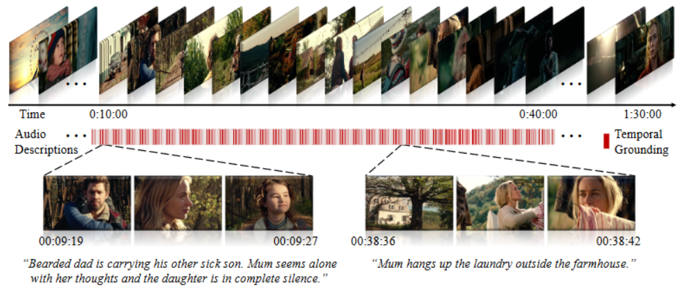

# VG
This is a project for Video Grounding. 



Video Grounding, also known as Video Moment Retrieval, Temporal Sentence Grounding in Videos. 

Input video and text, and output the corresponding text segment in video.


## 2D-TAN

Source code is from [MS-2D-TAN](https://github.com/microsoft/2D-TAN/tree/ms-2d-tan). This is an outdated project. Pytorch parallel training also uses DP, not DDP.

[Paper download](https://scholar.google.co.uk/scholar?hl=en&as_sdt=0%2C5&q=Multi-Scale+2D+Temporal+Adjacency+Networks+for+Moment+Localization+with+Natural+Language&btnG=)

## VLG-Net

Source code is from [VLG-Net](https://github.com/Soldelli/VLG-Net). This project's code is too coupled!

[ICCVW Paper](https://openaccess.thecvf.com/content/ICCV2021W/CVEU/papers/Soldan_VLG-Net_Video-Language_Graph_Matching_Network_for_Video_Grounding_ICCVW_2021_paper.pdf)

## submit

If your need submit job to Singularity. Please run:

```sh
$ amlt run submit/msroctovc.yaml GTR
```

How to setup Singularity. Please read:

[amulet installation guide](https://phillytools.azurewebsites.net/v9.3.2/setup.html)

\\msrasia\Share\Groups\IM\20220318 singularity\singulaity.pptx

## XYF

In this project we try to reproduce the GTR.

[Paper download](https://scholar.google.co.uk/scholar?hl=en&as_sdt=0%2C5&q=On+Pursuit+of+Designing+Multi-modal+Transformer+for+Video+Grounding&btnG=)


